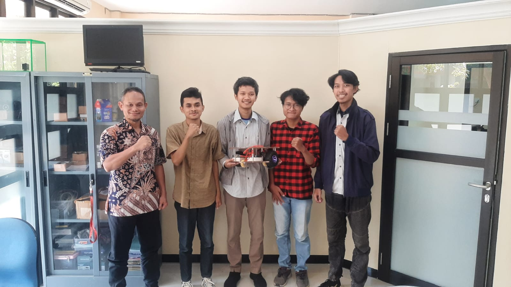

# Dokumentasi Kegiatan Perkuliahan

# Dosen Pengajar  
| Nama Lengkap                    | NIP/NIDN           |
|---------------------------------|--------------------|
| Dr. Basuki Rahmat, S.Si., MT.   | 196907232021211002 |

# Gambaran Umum IMCLab, ITCLab, dan IoT

## IMCLab (Intelligent Mechatronics and Control Laboratory)  
IMCLab adalah laboratorium riset yang fokus pada pengembangan sistem mekatronika cerdas dan kontrol otomatis. Laboratorium ini menggabungkan disiplin ilmu mekanika, elektronika, dan ilmu komputer untuk merancang dan mengembangkan sistem yang mampu beroperasi secara autonom dan adaptif dengan menggunakan teknologi cerdas, seperti pengendalian robotik, sistem kendali adaptif, dan integrasi sensor serta aktuator.

## ITCLab (Intelligent Control, Robotics and Automation Systems Laboratory)  
ITCLab merupakan laboratorium penelitian yang berfokus pada sistem kendali cerdas, robotika, dan otomasi. Laboratorium ini mengembangkan aplikasi praktis dari teori kendali dan robotika dalam berbagai bidang seperti robot mobile, otomasi industri, dan Internet of Things (IoT) untuk menciptakan sistem yang efisien dan dapat diandalkan dalam pengambilan keputusan otomatis.

## IoT (Internet of Things)  
IoT adalah konsep jaringan perangkat fisik yang saling terhubung dan dapat berkomunikasi melalui internet untuk mengumpulkan dan bertukar data. Dalam konteks laboratorium seperti IMCLab dan ITCLab, IoT digunakan untuk mengintegrasikan perangkat keras dan sensor ke dalam sistem kendali dan robotika yang memungkinkan pengawasan jarak jauh, pemantauan real-time, dan pengelolaan otomatis dalam berbagai aplikasi, seperti smart home, industri, dan kesehatan.

---

## Pertemuan 1  
**Pengantar Mata Kuliah Robotik**  
Pada pertemuan awal mata kuliah robotik, dilakukan sesi perkenalan seperti biasa. Kami berkenalan dengan dosen pengampu, Bapak Basuki Rahmat, lalu mulai mengenal gambaran umum tentang robotik. Penjelasan disampaikan terkait skema pembelajaran, penjelasan tugas UTS, dan juga rencana pengerjaan UAS selama mata kuliah ini berlangsung.

## Pertemuan 2  
**Pengenalan dan Instalasi Arduino IDE**  
Pada sesi kedua, fokus pembelajaran beralih pada instalasi Arduino IDE sebagai perangkat lunak utama dalam pemrograman mikrokontroler. Kami juga belajar cara memasang library penting yang akan digunakan dalam pengerjaan proyek robotik, serta mengonfigurasi beberapa pengaturan dasar yang diperlukan.

## Pertemuan 3  
**Praktik Pertama Arduino IDE dengan ITCLab**  
Di pertemuan ketiga, kami langsung praktik menjalankan program yang diberikan oleh Pak Basuki. Program tersebut mengendalikan mesin ITCLab yang berfungsi memutar "gerigi" dengan kecepatan yang mulai cepat lalu menurun hingga berhenti. Pengalaman ini mengenalkan kami pada konsep pengaturan kecepatan motor melalui pemrograman.

## Pertemuan 4  
**Praktik Menghidupkan dan Mematikan LED dengan Arduino IDE dan ITCLab**  
Pada pertemuan keempat, kami melakukan praktik pengoperasian LED menggunakan program yang sudah disediakan. Fokus utama adalah memahami pin digital pada Arduino dan proses pengunggahan program ke board melalui ITCLab.

## Pertemuan 5  
**Pengendalian Motor dengan IMCLab**  
Pembelajaran berlanjut dengan praktik kendali motor melalui IMCLab. Kami mempelajari penggunaan pin PWM serta prinsip dasar pengendalian penggerak motor dengan mikrokontroler lewat konfigurasi Arduino IDE.

## Pertemuan 6  
**Pengenalan IoT dan Penggunaan MQTT Panel**  
Materi perkuliahan beranjak ke konsep Internet of Things (IoT). Kami diarahkan untuk memasang aplikasi IoT MQTT Panel di smartphone, lalu belajar menghubungkan Arduino IDE dengan protokol MQTT menggunakan library PubSubClient. Untuk komunikasi, digunakan hotspot dari smartphone sebagai jaringan penghubung dengan memasukkan nama dan password hotspot ke dalam kode Arduino.

## Pertemuan 7  
**Praktik Pengontrolan Robot BNU V2 Melalui IoT MQTT Panel**  
Pada pertemuan ketujuh, kami melakukan kontrol langsung robot BNU V2 via aplikasi IoT MQTT Panel. Data perintah dikirim melalui MQTT dan diterjemahkan ke aksi nyata pada robot secara langsung, memberikan pemahaman praktis tentang komunikasi IoT berbasis protokol MQTT.

---

# Final Project

## Daftar Anggota Kelompok

| No | Nama Lengkap               | NPM         |
|----|----------------------------|-------------|
| 1  | Septianto Bagus Hidayatullah | 22081010178 |
| 2  | Atiqur Rozi                | 22081010010 |
| 3  | Regan Putra Ramadhan       | 22081010036 |
| 4  | Aqsa Prima Cahya           | 22081010059 |
| 5  | Brahma Faiq Mahdewa        | 22081010080 |

# Pengerjaan Final Project

# Pada Minggu 1 :
- Mencari dataset Waste Classification Data di kaggle [Lihat dataset](https://www.kaggle.com/datasets/techsash/waste-classification-data).
- Mulai membangun model CNN dari awal yakni dengan menggabungkan beberapa layer convolutional dengan beberapa layer yang lainnya.
- Melakukan training terhadap dataset training yang telah ditemukan.
- Melakukan evaluasi terhadap dataset testing yang telah ditemukan.
- Mendapatkan hasil yang kurang memuaskan karena dari hasil evaluasi hanya mendapatkan accuracy 0.5.

# Pada Minggu 2 :
- Mencoba meningkatkan nilai accuracy model agar menjadi lebih baik.
- Melakukan training model baru dengan dataset training.
- Melakukan testing model baru dengan dataset testing.
- Mendapatkan Hasil yang lebih baik dengan mendapatkan hasil accuracy pada tahap testing 0.83

# Pada Minggu 3 :
- Terus meningkatkan model klasifikasi sampah dengan akurasi 0.94 
- Membuat model computer vision yang menggabungkan model sebelumnya dengan model YOLO V8
- Membuat agar computer vision dapat terhubung dengan serial

# Pada Minggu 4 :
Uji coba program computer vision yang telah dibuat dengan robot BNU V2.

Hasil Uji Coba:
Robot telah kami setting untuk dapat melakukan identifikasi sampah organik dan anorganik. Ketika robot mendapati sampah anorganik berada di depannya, maka robot akan berbelok ke arah kiri. Sebaliknya, ketika robot mendapati sampah organik berada di depannya, maka robot akan berbelok ke arah kanan.

# Video Uji Coba Sampah Anogranik
Robot akan berbelok ke arah kiri setelah mengidentifikasi benda yang berada di depannya merupakan sampah anorganik.

# Video Uji Coba Sampah Organik
Robot akan berbelok ke arah kanan setelah mengidentifikasi benda yang berada di depannya merupakan sampah organik.

